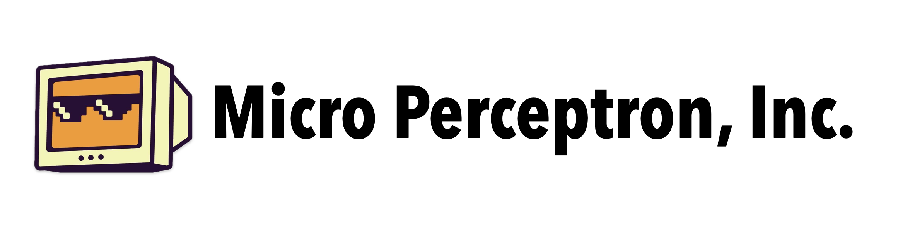

# Micro Perceptron, Inc.

### Niche software engineering company

We are a small, specialized software engineering company focused on building high-quality, niche applications. Our team is dedicated to delivering exceptional software solutions that meet the unique needs of our clients.

## Showcase

[**Our Website**](https://microperceptron.com) - Visit our official website to learn more about our services, team, and projects.

[**422rs.ai**](https://422rs.ai) - AI powered renewable energy planning and optimization platform, designed to help businesses and organizations make informed decisions about their energy usage and sustainability efforts.

**mVPP** - Decentralized Virtual Power Plant (VPP) platform that enables the integration and management of distributed energy resources (DERs) such as solar panels, wind turbines, and battery storage systems. It provides a secure and efficient way to optimize energy production and consumption.

## Contact Us
If you are interested in our services or have any questions, please feel free to open an issue in this repository, or reach out to us in the following ways:
- **Email**: [info@microperceptron.com](mailto:info@microperceptron.com)
- **Phone**: +1 (708) 529-5568
- **Hours**: Monday to Friday, 10 AM - 6 PM (CST)

## Registered Agent
[Legalinc Corporate Services Inc.](https://www.legalinc.com) - a registered agent service that handles our legal and compliance needs.
- **Address**: 131 Continental Dr Suite 305 Newark, DE, 19713 US

> *&copy; 2025 Micro Perceptron, Inc. All rights reserved. This README is licensed under the [CC BY-NC-SA 4.0](https://creativecommons.org/licenses/by-nc-sa/4.0/) license.*